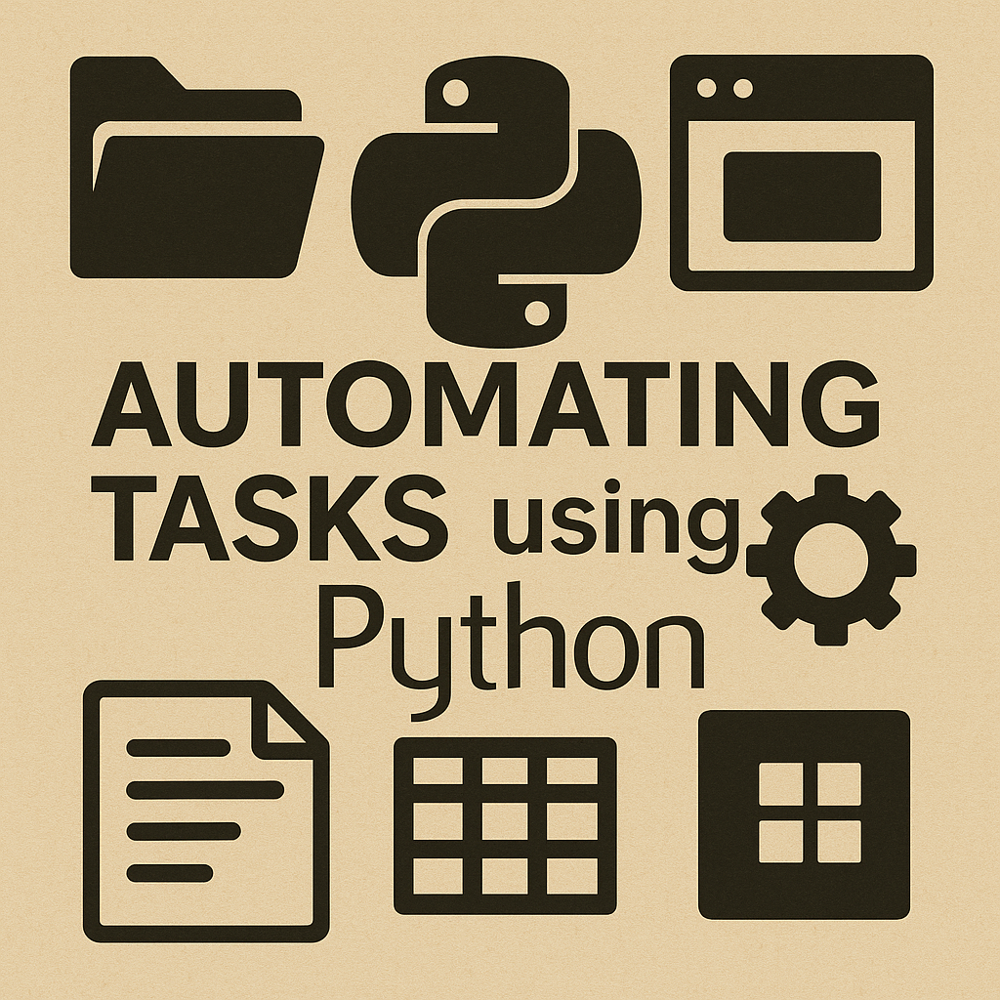

  

<h1 align="center">Automating Tasks using Python</h1>

  Practical 10-part course on automating real-world tasks using Python, with examples on Windows (most applicable to MacOS as well) and VS Code.

---

## 📘 About This Course

This repository contains all materials for the **Automating Tasks using Python** course:

- Example Python scripts  
- Data files for exercises  
- Project templates  
- Notebooks (optional)  
- Slides (optional)
